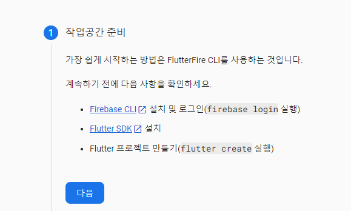
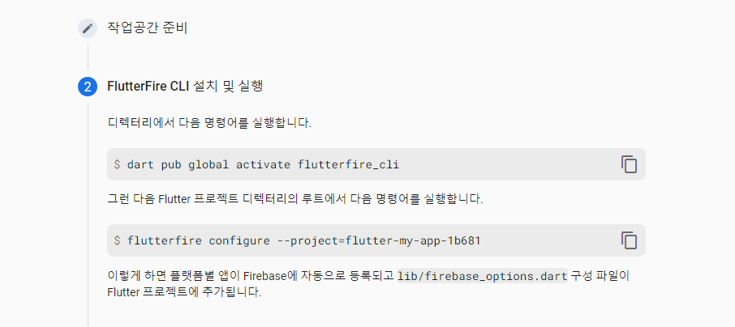
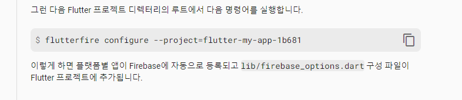
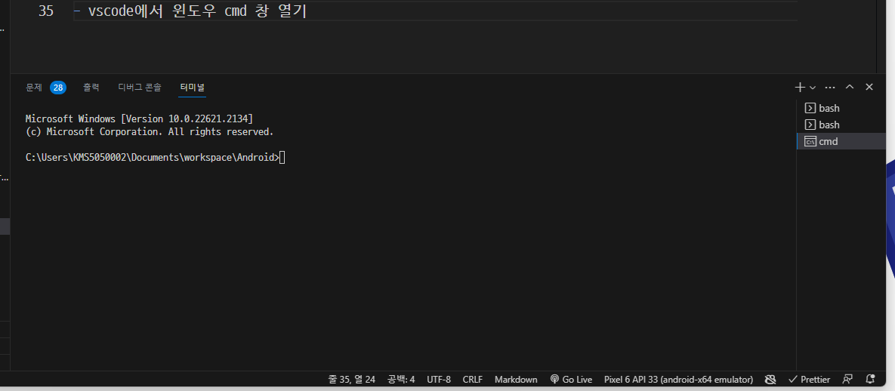
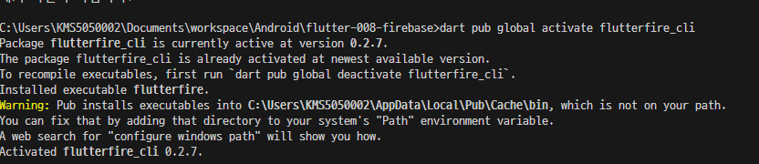
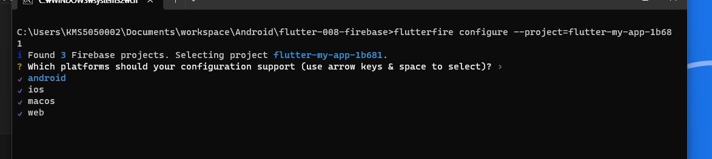
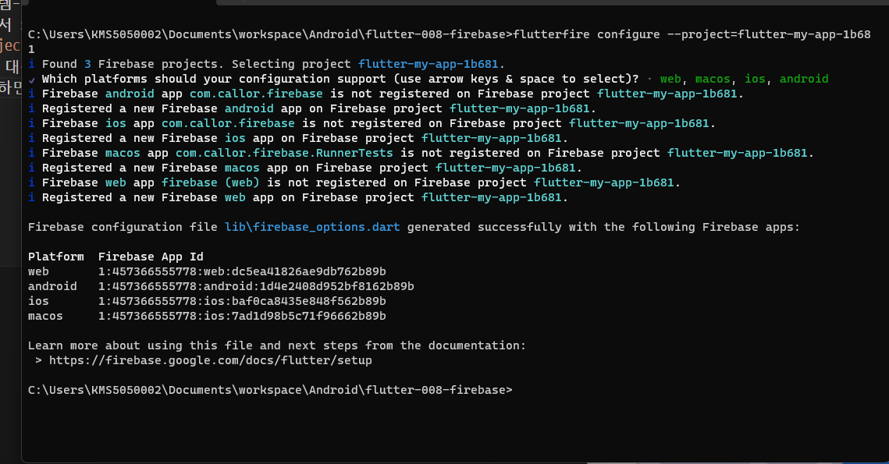
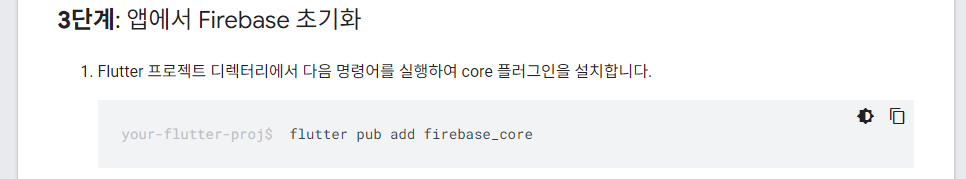

# flutter firebase 연동 프로젝트

- `auth(인증)`, `fireStore(DBMS)`, `real Database(DBMS)` 등을 연동해 프로젝트를 구현할 수 있다.
- 다른 프로젝트(react)에서는 Hostring 등도 사용할 수 있다.

## firebase-auth

- `firebase`를 통해 ,`Email 방식의 회원가입` ,`Email 방식의 로그인`을 구현할 수 있다.
- `google login` 등 `oAuth2(인증 Token 방식)` 방식의 인증을 구현할 수 있다.

## DBMS 연동 : fireStore, real Database

- `NoSQL` 방식으로 Data CRUD 를 구현할 수 있고,
- `1:1` 방식의 채팅도 구현가능
- `Message`전달 등도 구현 가능

절차 : https://firebase.google.com/?hl=ko -> 콘솔로 이동-> 프로젝트 추가-> 에털리틱스 꺼도 됨->
-> 완료 ->프로젝트 들어가서 flutter추가

## Flutter 와 firebase를 연동하기 위하여 사전 도구 설치

- Cli 도구 설치: `npm install -g firebase-tools@latest` <-flutter에서 설치하는거 맞음
- 설치확인을 위해 `firebase --version` 실행

## firebase 프로젝트 생성하기

- `firebase.google.com` 사이트에서 새로운 프로젝트 생성하기 <- 위에서 함
- 프로젝트 들어가서 생성된 프로젝트에 앱 추가하기 <-  여기서 F
  
  
- `firebase-cli` 명령을 내려 프로젝트 구성하기
- 터미널에서 `dart pub global activate flutterfire_cli`
- 그다음 comandprompt터미널에서 `flutterfire configure --project=flutter-my-app-1b681` <-이건 다 다르니까 가서 복붙

- vscode에서 윈도우 cmd 창 열기
- 왜냐하면 `flutterfire` 명령은 윈도우 cmd 창에서만 실행되기 때문에 cmd 창을 열고 실행해야 한다.
- 

- 새로 생성한 프로젝트로 폴더이동 하기:`cd 프로젝트이름` - cmd창에서 해야함
- 프로젝트 폴더에서 config 명령 실행: `flutterfire configure --project=flutter-my-app-1b681` <-이거

- dart pub global activate flutterfire_cli 명령 실행 후 경고가 나오면(cmd에서 실행)  시스템 path에 경로를 등록한다- 경고에 경로 있음
  `C:\Users\KMS5050002\AppData\Local\Pub\Cache\bin` 지금현재 경로인데 각자 자기가 나온걸 등록해야 한다.
- 고급시스템설정- 환경변수- 시스템- path-편집- 경로를 새로 만들기해서 넣으면 됨 위치 상관없음
- 이제 현재 프로젝트 폴더 들어가서 shift 오른쪽 해서 여기서 명령창열기 해서 각자 다른`flutterfire configure --project=flutter-my-app-1b681` 붙여넣기
- cmd 창에서 명령 실행 후 적용할 대상 선택
   웬만하면 4개 다 킴
   - 만약 오류나면 다시 실행

- 여기까지 하면 설치는 완료

## 프로젝트에 dependency 설정하기

- 이제 다시 웹으로 가서 다음 누르고 console 화면에서 firebase plugin 설정으로 진행하기
  진행방법 :  클릭
- 이 화면에서 올라가면  여기서 안드로이드 선택 이제 인증 cloud Firestore 등 필요한거 설치 .
  이제

-  `flutter pub add firebase_core`

```bash
firebase login
flutter pub add firebase_core
flutter pub add firebase_auth
```

실행해서 확인

- 만약 안되면 디바이스 pixel로 바꾸고 다시 시도
- dependency 를 정상적으로 설치했는데, app 실행에 문제가 발생하는 경우가 있다. dependency 들의 version 이 서로 맞지 않아 발생하는 경우인데 다음 명령으로 clean을 실행한다

```bash
flutter pub upgrade outdated package
flutter clean
flutter pub get
```

여기까지가 auth(인증) 사용하는 방법
