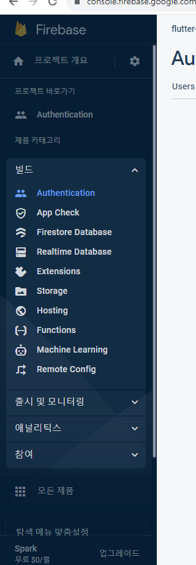
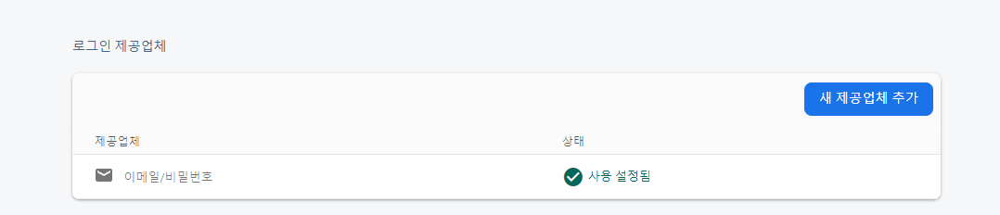
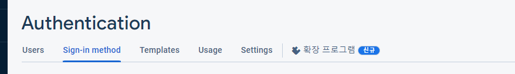
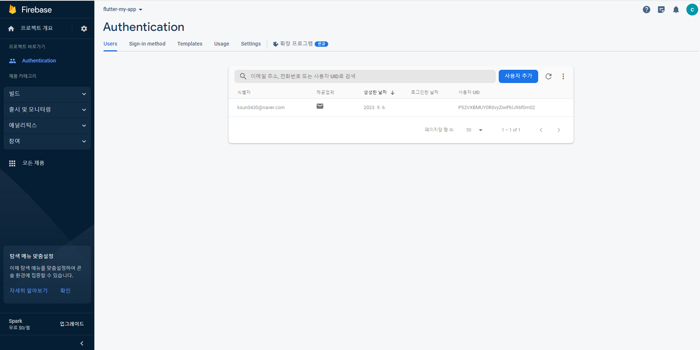

# firebase_auth사용해 인증하기

firebase 프로젝트의 왼쪽바의 빌드의 Authentication 들어가서 시작하기 

## 기본인증 선택하기

- 기본인증은 `이메일/비밀번호` 선택하기
   이후 저장
  그럼 이렇게 나옴 
   여기서 유저 클릭
  이후 사용자 추가
  

이제 연동-

```dart
main.dart에서
WidgetsFlutterBinding.ensureInitialized();
 Firebase.initializeApp(
    options: DefaultFirebaseOptions.currentPlatform,
  );
```

을 runApp 위에 추가

그럼 이렇게 됨

```dart
void main() async {
  WidgetsFlutterBinding.ensureInitialized();
  Firebase.initializeApp(
    options: DefaultFirebaseOptions.currentPlatform,
  );
  runApp(const App());
}
```

<!-- 그리고 login_page에서 버튼을 다음과 같이 변경 -->

```dart

ElevatedButton(
                  // 버튼을 누르면 modules/validate.dart의 validate() 가 실행되고 유효성 검사 실행됨
                  onPressed: () async {
                    _formKey.currentState?.validate();
                    var result =
                        await FirebaseAuth.instance.signInWithEmailAndPassword(
                      email: "ksun0430@naver.com",
                      password: "!korea8080",
                    );
                  },
                  child: const Text("로그인 ElevatedButton")),
```
