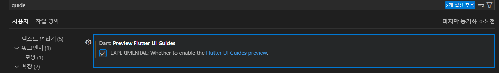

# vsCode flutter 개발 환경

- flutter 검색해 extention 설치
  
- 자동완성 세팅: `설정` 에 접속하여 실행
- 
- codeAction On Save 에서 : `settings.json` 편집 클릭 후 "editor.codeActionsOnSave"에 추가
  
  "editor.codeActionsOnSave": {
  "source.fixAll": true,
  "source.fixAll.eslint": true
  },

- widget tree guide 추가하기
- 설정에서 `guide ` 검색하여 `Dart: Preview Flutter Ui Guides ` 체크
  
